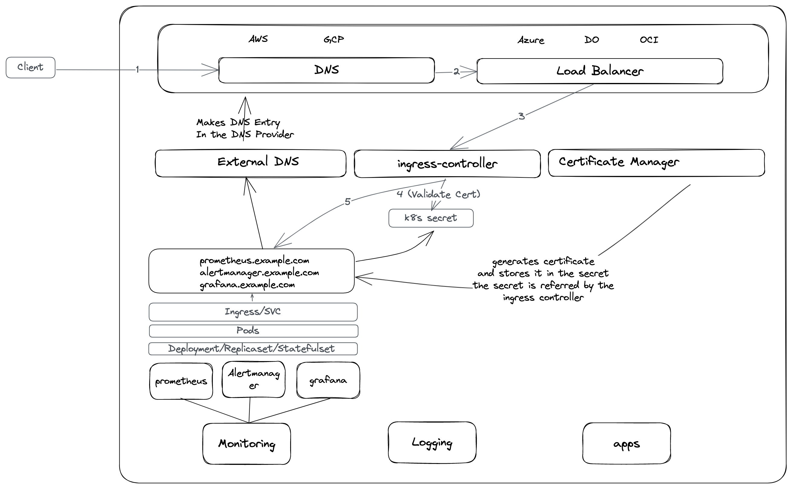

# kubernetes-cluster-setup
This repository helps to setup operational components in a newly created kubernetes cluster.

Operational components includes:
* Monitoring
* Logging
* Ingress Controller
* External DNS
* Certificate Manager

Please refer to below image to understadn how these components work together.

Following components are currently supported.

* monitoring
* nginx-ingress